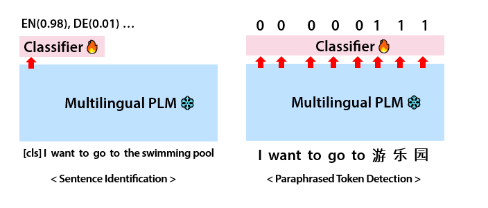
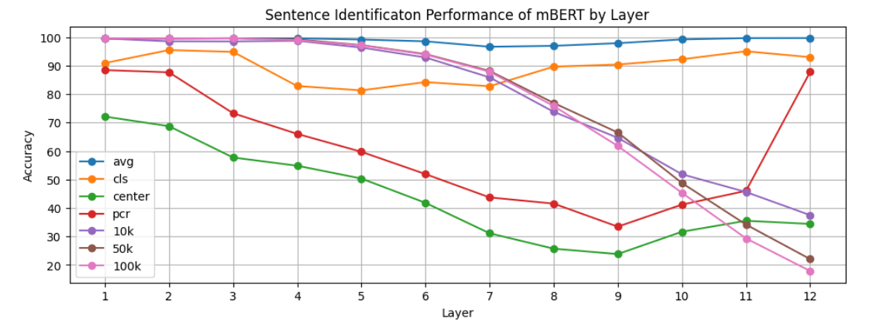
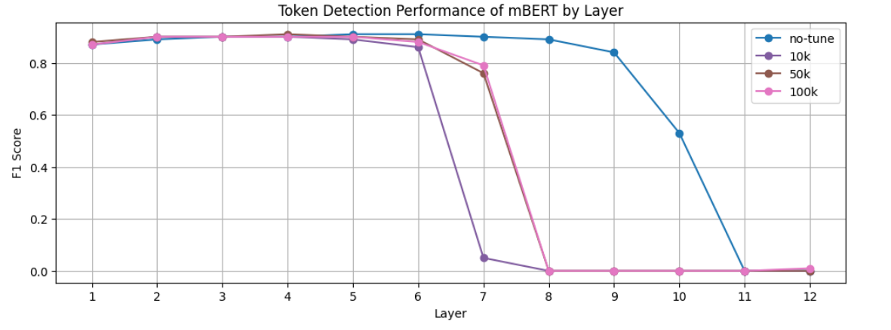

# Probing Language Neutrality of Multilingual Representations
> __Summary of "Revisiting the Language Neutrality of Pre-trained Multilingual Representations through Contrastive Learning"__ 

## 1. Introduction 
- __Language Neutrality__, which is often called language agnostic nature, has been treated as a core concept in the field of multilingual PLMs. Since the pre-trained multilingual representations is projected ​​into the unified vector space regardless of its language, it can represent universal meaning if the representations do not include characteristics of each language.
- It is believed that the language neutrality can be improved by alleviating the subspaces of each language in the vector space(Liboviky et al., 2020; Yang et al., 2021; Choenni and Shoutova, 2020; Xie et al., 2024). To verify this, we analyze how __Contrastive Learning__, which deconstructs the subspaces, affects the PLM's language recognition.

## 2. Probing Method

- A __Probing Classifier__ is used to analyze language discrimination ability of multilingual PLMs. If the PLMs' representations contain few characteristics of each language, which is the status of language neutrality, the classifier will not be able to identify the language. The classifier is trained for the following two probing tasks: __(1) Sentence Identification__ __(2) Paraphrased Token Detection__.  

  

- We train a series of classifiers using the representations from each layer of the PLMs in order to observe changes according to the layer __(layer-wise probing)__. In addition, we train them using *the summed representations*, including those of previous layers, to check which layer adds 'new' information identifying the languages __(cumulative scoring)__.

- After training, the classifiers are evaluated on the test set in the same setting as the training. We compare the case of a multilingual PLM with that of sentence encoders trained through contrastive learning (using 10k, 50k, and 100k XNLI pairs). We also consider the case when performing __Centering__ or __Principal Component Removal (PCR)__ on the multilingual PLM's representations.

## 3. Evaluation (mBERT-cased)

### 3.1. Sentence Identification

□ __Layer-wise Probing__

  

- As can be seen in the graph above, <ins> __contrastive learning reduces language identification information in the upper layers__  </ins>, causing the classifier to be confused in distinguishing the language. As the model learns more sentences through contrastive learning, this tendency becomes stronger.

□ __Cumulative Scoring__

|Layer|1|2|3|4|5|6|7|8|9|10|11|12|
|:---:|:---:|:---:|:---:|:---:|:---:|:---:|:---:|:---:|:---:|:---:|:---:|:---:|
|cls|90.89|89.08|86.54|80.34|83.53|87.73|85.61|87.26|88.18|89.15|93.08|94.18|
||(0.0)|(-1.81)|(-2.54)|(-6.20)|(+3.19)|(+4.20)|(-2.12)|(+1.65)|(+0.92)|(+0.97)|(+3.93)|(+1.10)|

- 

### 3.2. Paraphrased Token Detection

□ __Layer-wise Probing__
 

  

- The upper layers of all models cannot detect paraphrased tokens. Especially, in the cases of the sentence encoders trained through contrastive learning, this pattern begins from the lower layers. It can be interpreted that <ins> __contrastive learning makes it more difficult to detect a small number of tokens of other languages ​​among a large number of English tokens__ <ins>.

## 4. Conclusions
